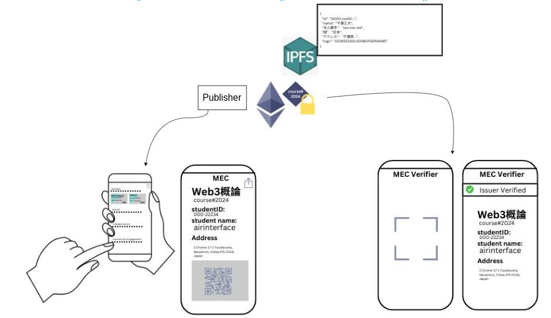

## Micro Edge Certs (MEC) について

Micro Edge Certs (MEC) は、ブロックチェーン技術を活用した学習履歴ポートフォリオサービスです。

学習歴、認定資格、学位などを国際的に通じるバッジとして安全に保管・共有できます。
アプリとして開発中で、世界中で利用可能です。

### 主な利用者

1. **利用者 (Holder):** バッジの申請、取得、保管、共有を行います。
2. **発行者 (Issuer):** バッジの発行、
3. **認証者 (Verifier):** バッチの認証を行います。

### 開発チーム

* **開発者チーム:** アプリの開発を担当します。
* **ドキュメントチーム:** アプリに関するドキュメントの作成を担当します。

### 開発の流れ

1. **発行者用登録サイトの作成:** まず、発行者がバッジを発行するための登録サイトを作成します。
2. **利用者閲覧アプリの作成:** 次に、利用者が自分のバッジを確認・共有するための閲覧アプリを作成します。
3. **閲覧者アプリの作成:** 次に、利用者が自分のバッジを確認・共有するための閲覧アプリを作成します。

**MEC は、個人の学習成果を証明し、キャリアアップを支援するための強力なツールとなるでしょう。**
